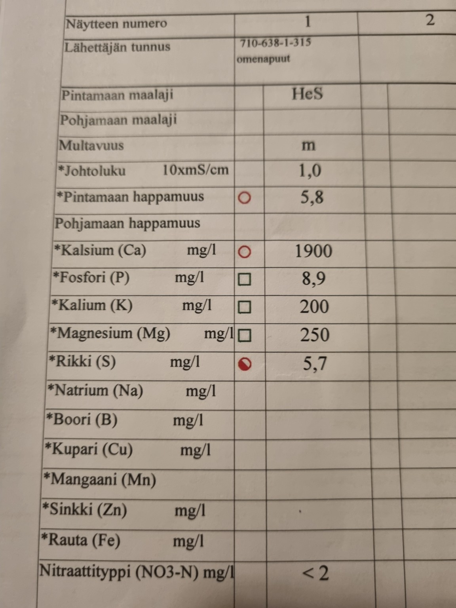

AI is changing life even in a field as conservative as agriculture. Here is a small practical example: I uploaded our apple orchard's soil analysis to the AI assistant Claude and asked it to interpret the results and give recommendations.

## Soil analysis results

The sample was taken from the apple orchard. The soil type is sandy clay (HeS). Here are the key results:

| Measurement | Value | Assessment |
|-------------|-------|------------|
| pH | 5.8 | ⚠️ Low |
| Calcium (Ca) | 1900 mg/l | Moderate |
| Phosphorus (P) | 8.9 mg/l | ⚠️ Low |
| Potassium (K) | 200 mg/l | Good |
| Magnesium (Mg) | 250 mg/l | Good |
| Sulfur (S) | 5.7 mg/l | ⚠️ Low |
| Nitrate nitrogen (NO₃-N) | <2 mg/l | ⚠️ Very low |

## AI recommendations

Here is Claude's analysis and action plan:

**1. Liming — raise the pH**

A pH of 5.8 is slightly too low for apple trees — the optimal range is 6.0–6.5. Low pH reduces nutrient availability, especially phosphorus. Recommendation: dolomite lime at 3–4 t/ha. Dolomite lime raises pH while also supplying calcium and magnesium.

**2. Phosphorus — P is low**

8.9 mg/l is insufficient for fruit trees. Phosphorus is important for root development and flower bud formation. Recommendation: rock phosphate or superphosphate applied in spring. Liming also improves phosphorus availability.

**3. Nitrogen — nearly zero**

Nitrate nitrogen below 2 mg/l means there is very little plant-available nitrogen in the soil. Spring nitrogen fertilization is needed — for example calcium ammonium nitrate or an organic option such as composted manure pellets. Nitrogen should be applied at the start of the growing season, not in late autumn.

**4. Sulfur — needs supplementation**

Sulfur at 5.7 mg/l is low. Sulfur can be supplied through potassium sulfate, which also serves as a potassium supplement.

**5. Micronutrients — further testing needed**

Boron, copper, manganese, and zinc are missing from the analysis. For apple trees, boron is especially critical — boron deficiency causes fruit deformities and poor pollination. I recommend requesting a micronutrient analysis next time.

## Next step — choosing products

After the analysis, I gave Claude a link to the fertilizer supplier's website — [Viljelijän Berner](https://viljelijanberner.fi/lannoitteet-ja-maanparannus) — and asked it to pick suitable products based on the soil analysis. Claude went through the product range and suggested specific items:

- **Lime** to raise pH (dolomite lime as a source of calcium and magnesium)
- **Garden fertilizer** for phosphorus and nitrogen supplementation
- **Supplementary fertilizer** for sulfur correction

The entire process — from analysis to product recommendations — took a few minutes. No need to scroll through product catalogs and figure out which product fits which need.

## Conclusion

The whole analysis took about one minute. AI does not replace agronomy, but it is an excellent tool for quick interpretation and planning support. Instead of puzzling over tables alone, you can have a quick conversation with AI and get a clear starting point for action. It's all very simple!
