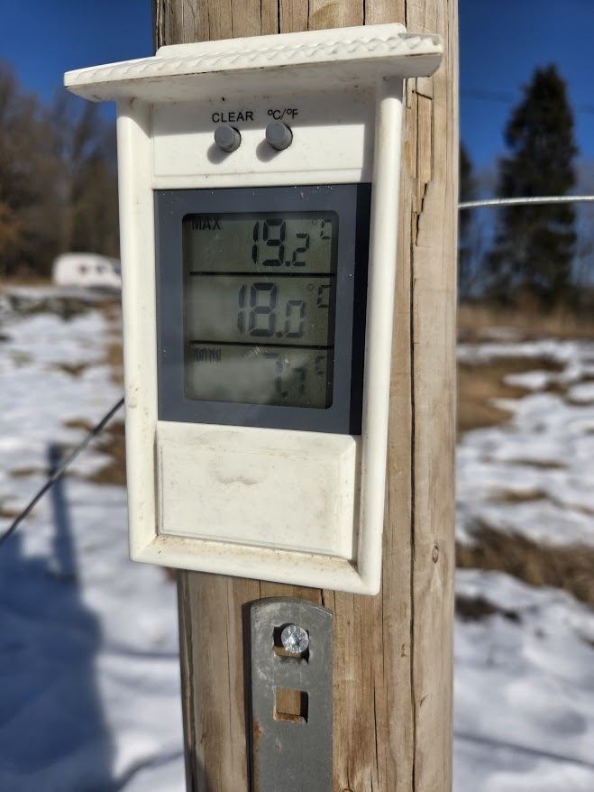
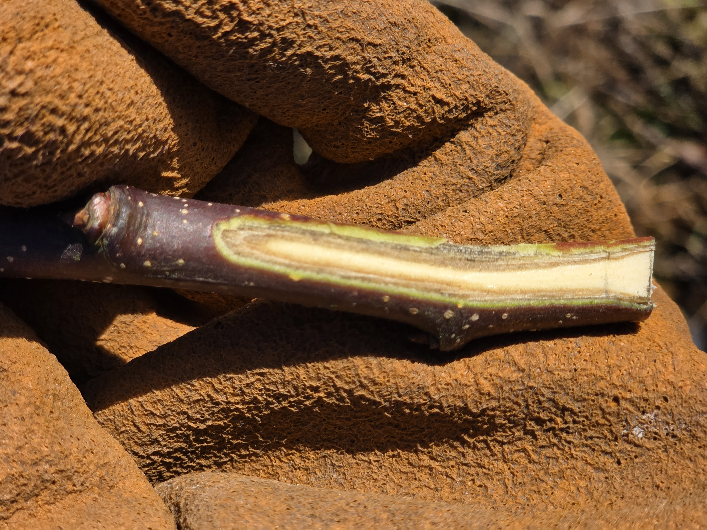

Tänään oli upea sää — kirkas aurinko, lumi alkoi hieman sulaa ja hanki kantoi hyvin. Mittari näytti +18 °C auringossa, ja maksimi nousi jopa 19,2 asteeseen.

## Kevätauringon vaara

Vaikka lämmin kevätpäivä tuntuu ihanalta, se voi olla vaarallinen hedelmäpuille. Kun aurinko lämmittää puun rungon voimakkaasti päivällä ja yöllä lämpötila laskee jyrkästi pakkasen puolelle, rungon kuori voi halkeilla. Tätä kutsutaan pakkashalkeamiksi. Pahimmillaan vauriot voivat johtaa puun kuolemaan.

Yleensä vauriot syntyvät juuri lumirajaan — hieman lumipeitteen yläpuolelle, missä auringon lämmittävä vaikutus on voimakkain. Mietimme usein, kumpi rinne on hedelmäpuille parempi — eteläinen vai pohjoinen. Tilallamme on molemmat, ja molemmilla on puolensa.

## Suojaus

Suojaamme puiden rungot valkoisella muovisella hienosilmäverkolla. Se suojaa kolmelta uhalta kerralla: auringonpaisteelta, myyrätuhoilta ja jänistuhoilta.

## Talvivaurioiden arviointi

Kova talvi on jättänyt jälkensä. Kun leikkaamme oksia, näemme heti, miten puu on selvinnyt talvesta — terveen oksan jälsikerros on vihreä, vaurioituneen ruskea.

Huonosti ovat selvinneet erityisesti eurooppalaiset päärynälajikkeet. Jopa minnesotalainen Summercrisp-päärynä sai merkittäviä vaurioita. Sen sijaan venäläiset päärynälajikkeet — Tšiževskaja, Lada, Tatjana ja Velesa — ovat täysin vahingoittumattomia ja leikkauspinnalta vihreitä.

Omenalajikkeista Gala, Rubín ja Topaz kärsivät vaurioita. Tšekkiläiset lajikkeet eivät ole luotettavia tässä ilmastossa.
