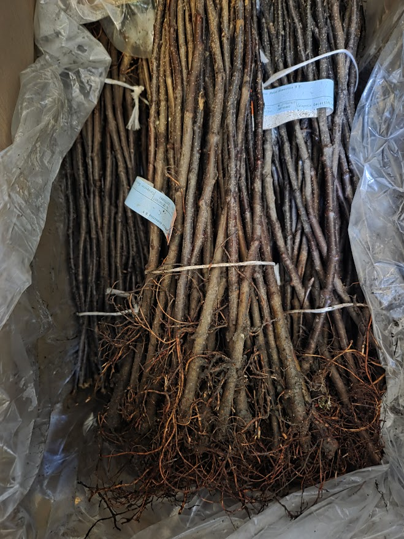
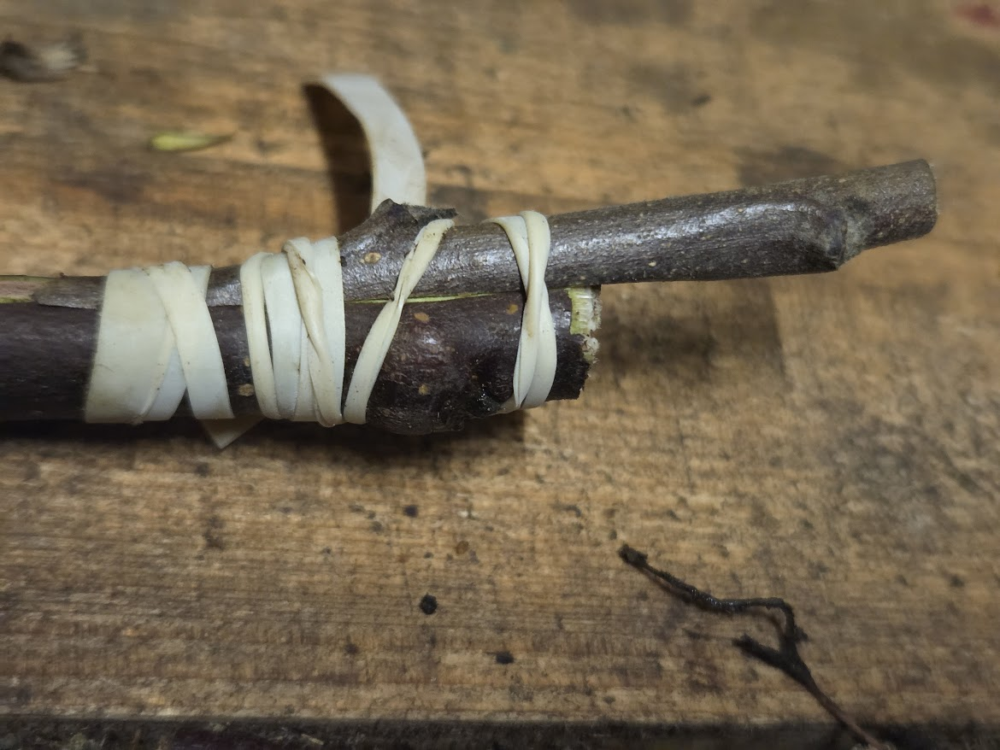
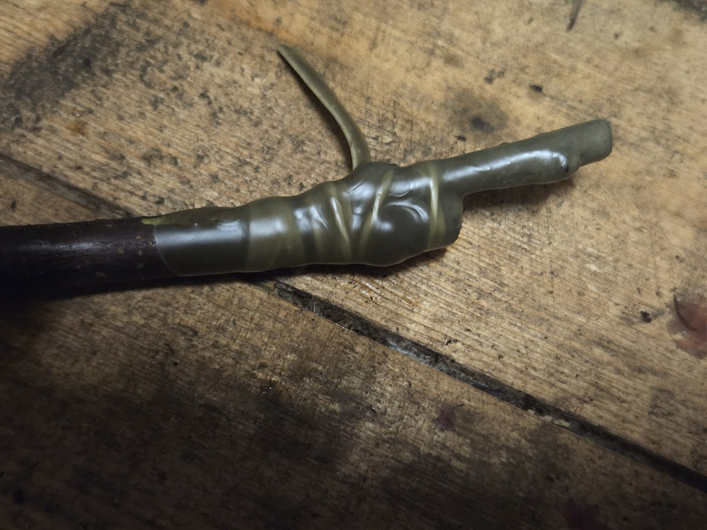
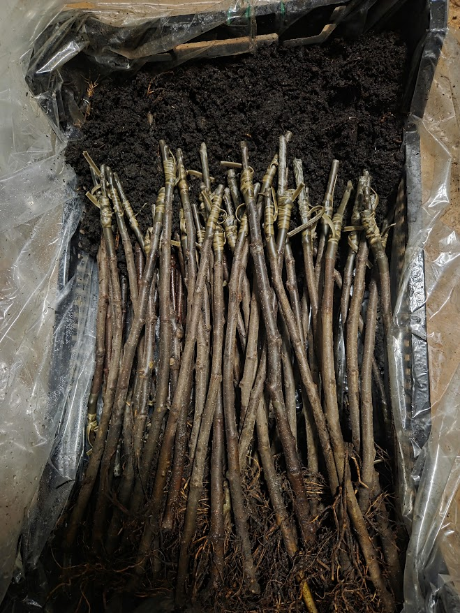
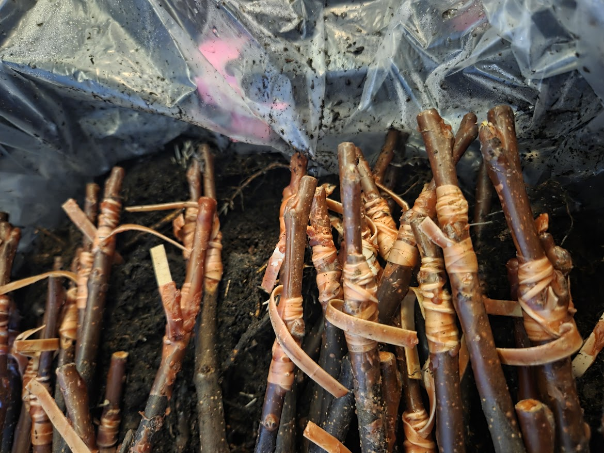

Talvivarttaminen (eli pöytävarttaminen) on yksi tehokkaimmista tavoista tuottaa uusia omenapuuntaimia. Työ tehdään sisätiloissa pöydän ääressä, kun perusrungot ja varteoksat ovat talvilevossa.

## Ajoitus

Teoriassa talvivarttamisen voi aloittaa jo tammikuussa, mutta silloin varrikkeiden säilytys vaatii erityistä huomiota — on pidettävä tasaisesti 0...+2 °C useita kuukausia. Me teemme varttamisen alkukeväästä, maaliskuussa, jolloin säilytysaika jää lyhyeksi ja varrikkeet pääsevät pian maahan.

## Perusrungot

Käytämme kääpiöiviä ja puolikääpiöiviä perusrunkoja. Ne saapuvat nipuissa ja säilytetään kosteana ja viileänä ennen varttamista. Muutama päivä ennen varttamista perusrungot tuodaan lämpimään — tämä herättää jälsikerroksen ja parantaa varttamisen onnistumista.

## Varttaminen

Kun perusrunko ja varteoksa ovat suunnilleen samaa paksuutta, käytämme kopulointia kielekkeen kanssa: molempiin leikataan viistopinta ja kielekkeet, jotka lukittuvat toisiinsa tiiviisti. Jos varteoksa on selvästi perusrunkoa ohuempi, vartetaan ilman kielekettä — pelkkä viistoleikkaus riittää, kunhan jälsikerrokset kohtaavat vähintään toiselta puolelta.

Sidontaan käytämme kumijännettä (kumirenkaita). Tämä menetelmä on käytännöllinen, koska kumi puristaa varteen ja perusrungon napakasti toisiaan vasten ja varmistaa hyvän jälsikontaktin. Sidontakalvoa ei tarvitse erikseen poistaa — kumi hajoaa itsestään kasvin kasvaessa.

## Vahaus

Sidonnan jälkeen vartepaikka kastetaan sulaan vahaseokseen. Vaha suojaa liitoskohtaa kuivumiselta ja taudinaiheuttajilta. Käytämme vaha-vesiseosta, joka muodostaa ohuen suojaavan kalvon.

## Stratifikaatio

Vahatut varrikkeet ladotaan laatikoihin ja peitetään kostealla turpeella tai sahanpurulla. Laatikot pidetään lämpimässä (+18...+22 °C) 7–10 päivää. Tänä aikana vartepaikassa alkaa muodostua kallusta — solukko, joka yhdistää perusrungon ja varteoksan.

## Säilytys ja istutus

Stratifikaation jälkeen varrikkeet siirretään viileään varastoon (0...+2 °C), missä ne odottavat istutusta. Istutusaika on huhtikuun loppu — toukokuu, kun maa on sulanut ja yöpakkaset hellittäneet.
