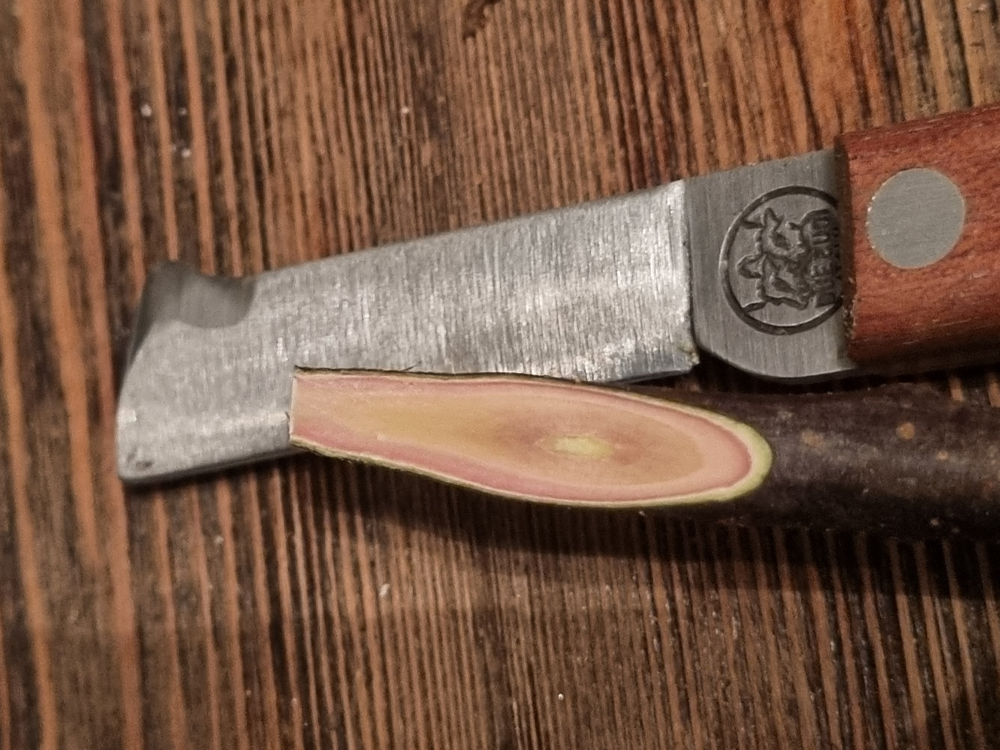
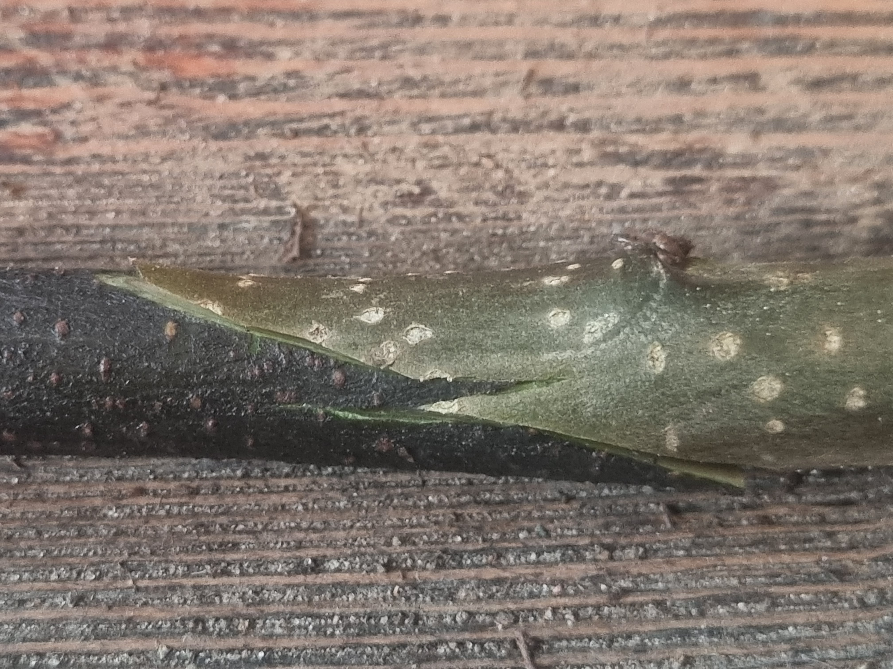
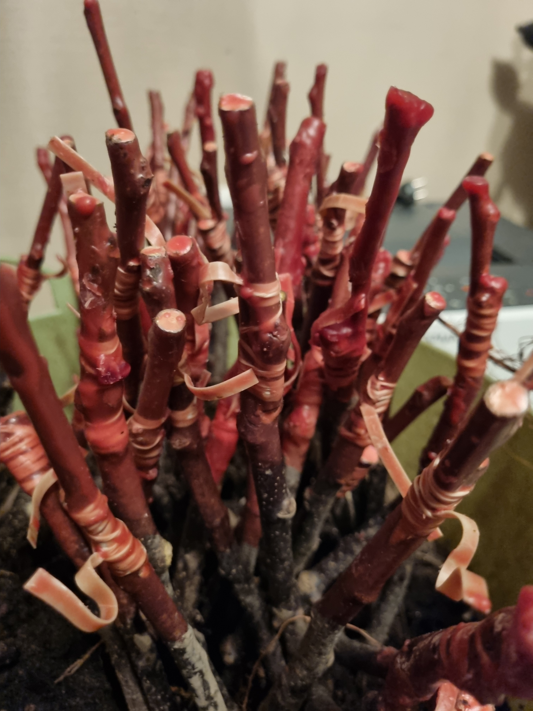

Nästan alla äppelträd som växer på vår gård har odlats själva från grunden. Vi använder B.9-dvärg­grundstam som passar bra för tätplantering och håller träden låga.

Ympningen sker på två sätt: på vintern eller tidig vår som spröympning, eller i augusti genom okulering. I båda metoderna förenas den önskade sortens växtceller med grundstammen så att resultatet blir exakt det träd vi vill ha.

Vid vinterympning skärs grundstam och ympkvist snett och fogas samman. Det viktigaste är att kambiumlagren möts — då växer förbindelsen ihop på några veckor.

Den här vintern ympades återigen en ny omgång träd. De färdiga ymparna binds med gummiband och förvaras svalt till våren, då de planteras i plantskole­bädden för att växa.

