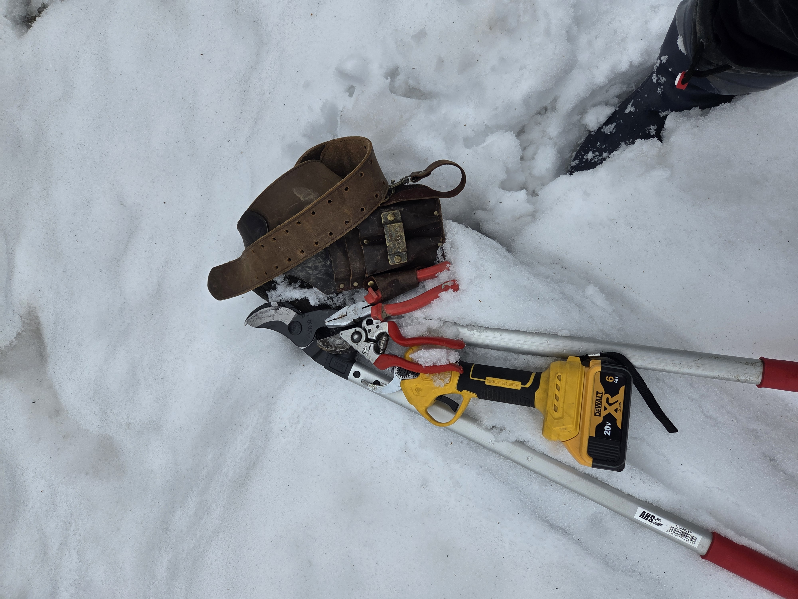
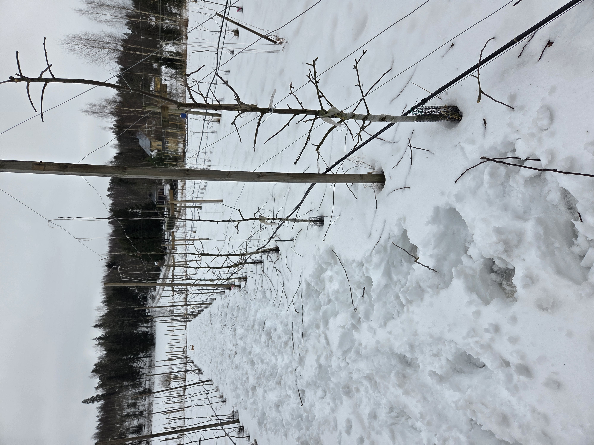

Slutet av februari, början av mars — när temperaturen inte längre sjunker under -10 °C är det dags att börja med vårklippningen av äppelträden. Vid för hård kyla är grenarna sköra och snitten läker inte ordentligt, men i det mildare senvintervädret går arbetet bra.

## Varför är beskärning viktigt?

Syftet med beskärningen är att hålla skörden nära centralstammen. När frukterna växer nära stammen får de mer ljus och näring — och kvaliteten blir bättre. Samtidigt förbereder klippningen nästa års skörd: nya blomknoppar bildas på sommarens tillväxt, och ett korrekt beskuret träd producerar jämnare år efter år.

## Tall spindle-beskärning

I en intensiv äppelodling använder vi den så kallade tall spindle-metoden. Principen är ganska enkel:

- **Grova grenar** tas bort helt och hållet intill stammen
- **Medelgrova grenar** klipps till en kort stubbe — från den växer en ny, svagare gren i sommar som bär bättre frukt
- **Kronans bredd** hålls i schack: alla grenar som sticker ut åt sidorna kortas så att kronan inte överskrider den fastställda bredden
- **Förgreningar** förenklas — om en gren delar sig åt olika håll behåller vi bara en riktning

Så hålls trädet smalt och ljust, och varje äpple får solljus för att mogna perfekt. Vårklippningen är ett av de viktigaste arbetena i fruktodlingen — och den pågår just nu i Svartå.
