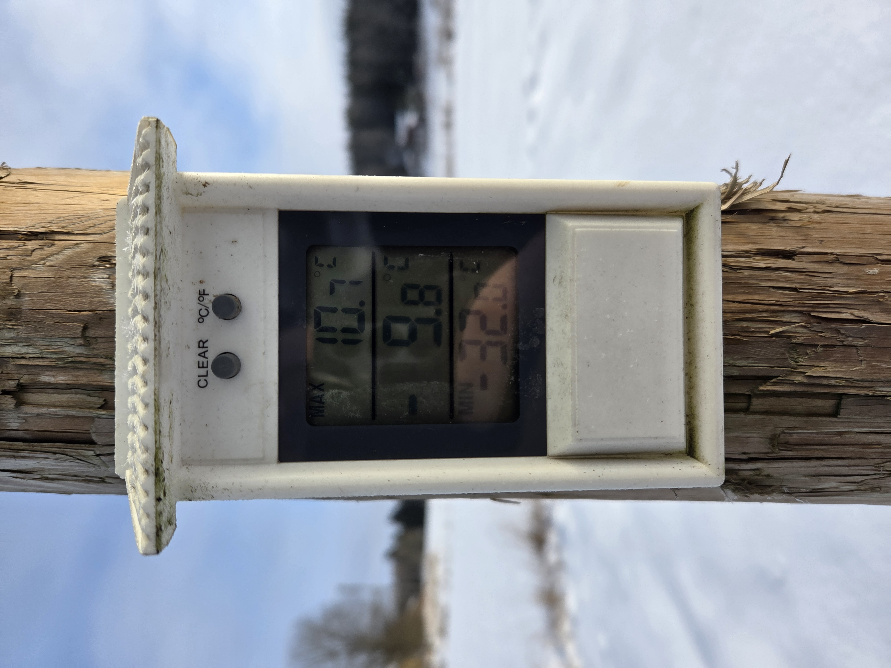

På gårdens kallaste och lägsta punkt visade termometern ett minimum på –32 grader. Den kalla luftmassan gled nerför sluttningen ner i svackan, som den alltid gör under klara och vindstilla vinternätter.

Temperaturen varierar förvånansvärt mycket på gården. Skillnaden i minimitemperaturer mellan olika delar av gården kan vara 3–4 grader — vilket ibland är avgörande för trädens överlevnad. Några grader mindre frost kan betyda skillnaden mellan ett friskt träd och en frostskadad gren.

Det är en av anledningarna till att val av sort och grundstam samt planering av planteringsplatser är så viktiga i nordlig fruktodling.
